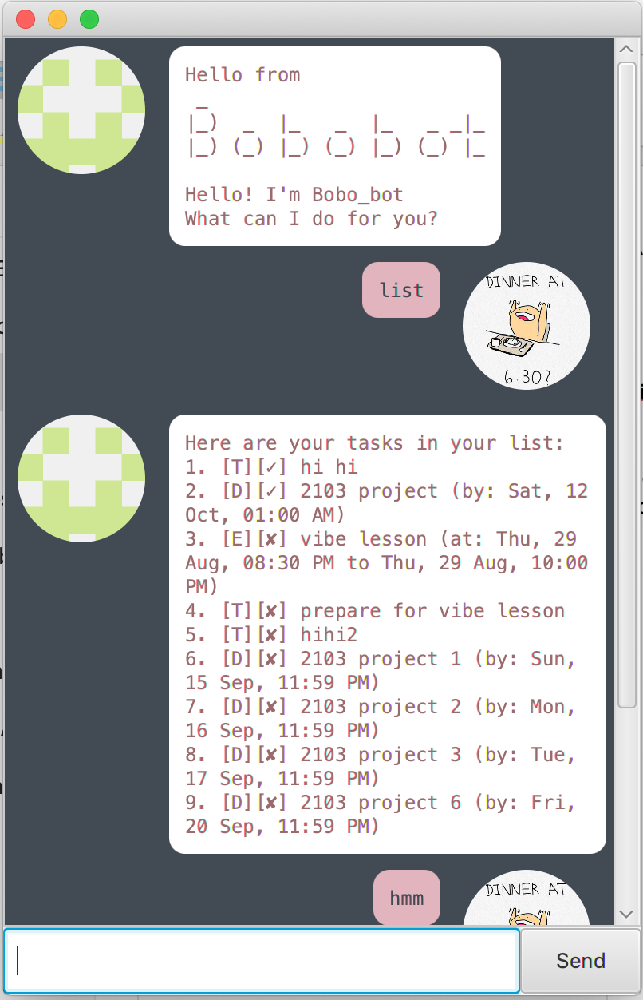

# User Guide

## Overview
Bobo_bot is a simple task list manager that allows users to easily manage their tasks with simple text commands.

### Snapshot of Bobo_bot


*Credits to [Timothy Leong](https://github.com/timothyleong97) for illustration of dinner boi.*

## Features 

### Task Creation, Deletion and Completion
Bobo_bot allows for the creation of 3 different types of tasks: `Todo`,`Deadline`, and `Event`. The differences between
these tasks are as follows:
- `Todo`: Simple tasks that can be accomplished at any particular time.
- `Deadline`: Tasks that have a deadline associated with it.
- `Event`: Tasks that take place within a certain time period.
Tasks can also be marked as done with the `done` command, and deleted with the `delete` command.

### Task Searching
Bobo_bot also allows for simple searching of tasks by specifying a keyword to the command `find`.

### Task Snoozing
Tasks can be snoozed easily at your choice of time intervals.


## Usage

### `todo` - Describe action

Adds a `todo` task for bobo_bot to track.

Example of usage: 

`todo <Description of task>`  
`todo say hi to bobo_bot!`

Expected outcome:
```
Got it. I have added this task:
 [T][✗] say hi to bobo_bot!
```


### `deadline` - Describe action

Adds a `deadline` task for bobo_bot to track.

Example of usage: 

`deadline <Description of task> /by <dd/mm/yyyy hhmm>`  
`deadline finish 2103 ip /by 20/09/2019 2359`

Expected outcome:
```
Got it. I have added this task:
 [D][✗] finish 2103 ip (by: Fri, 20 Sep, 11:59 PM)
```


### `event` - Describe action

Adds a `event` task for bobo_bot to track.

Example of usage: 

`event <Description of task> /at <dd/mm/yyyy hhmm-hhmm>`  
`event 2103 meeting tonight /at 17/09/2019 2000-2100`

Expected outcome:
```
Got it. I have added this task:
 [E][✗] 2103 meeting tonight (at: Tue, 17 Sep, 08:00 PM to Tue, 17 Sep, 09:00 PM)
```


### `done` - Describe action

Marks a specific task as done.

Example of usage: 

`done <task number>`  
`done 1`

Expected outcome:
```
Nice! I have marked this task as done:
 [T][✓] say hi to bobo_bot!
```


### `delete` - Describe action

Deletes a specific task.

Example of usage: 

`delete <task number>`  
`delete 1`

Expected outcome:
```
Noted. I have removed this task:
 [T][✓] say hi to bobo_bot!
```


### `list` - Describe action

List the tasks that bobo_bot is currently tracking.

Example of usage: 

`list`

Expected outcome:
```
Here are your tasks in your list:
1. [T][✓] vibe lesson prepation
2. [T][✓] 2131 homework
3. [T][✓] 2103 ui upgrade
4. [D][✗] finish 2103 ip (by: Fri, 20 Sep, 11:59 PM)
5. [E][✗] 2103 meeting tonight (at: Tue, 17 Sep, 08:00 PM to Tue, 17 Sep, 09:00 PM)
6. [T][✗] 2103 finish up readme docs
7. [T][✗] 2103 polish up user stories
```


### `find` - Describe action

Finds and returns a list of tasks that contains the user specified keyword.

Example of usage: 

`find <keyword>`  
`find 2103`

Expected outcome:
```
Found them! Here are the matching tasks in my list:
1. [T][✓] 2103 ui upgrade
2. [D][✗] finish 2103 ip (by: Fri, 20 Sep, 11:59 PM)
3. [E][✗] 2103 meeting tonight (at: Tue, 17 Sep, 08:00 PM to Tue, 17 Sep, 09:00 PM)
4. [T][✗] 2103 finish up readme docs
5. [T][✗] 2103 polish up user stories
```


### `snooze` - Describe action

Snoozes a particular task by a user specified amount of time.

Possible units of time to snooze by:
- `m`: minutes
- `h`: hours
- `d`: days
- `w`: weeks
- `M`: months

Example of usage: 

`snooze <task number> <length> <time unit>`  
`snooze 5 2 d`

Expected outcome:
```
Okay! I have snoozed your task:
 [E][✗] 2103 meeting tonight (at: Thu, 19 Sep, 08:00 PM to Thu, 19 Sep, 09:00 PM)
```


### `bye` - Describe action

Bobo_bot replies with a good bye message.

Example of usage: 

`bye`

Expected outcome:
```
Bye! Hope to see you again soon!
```
